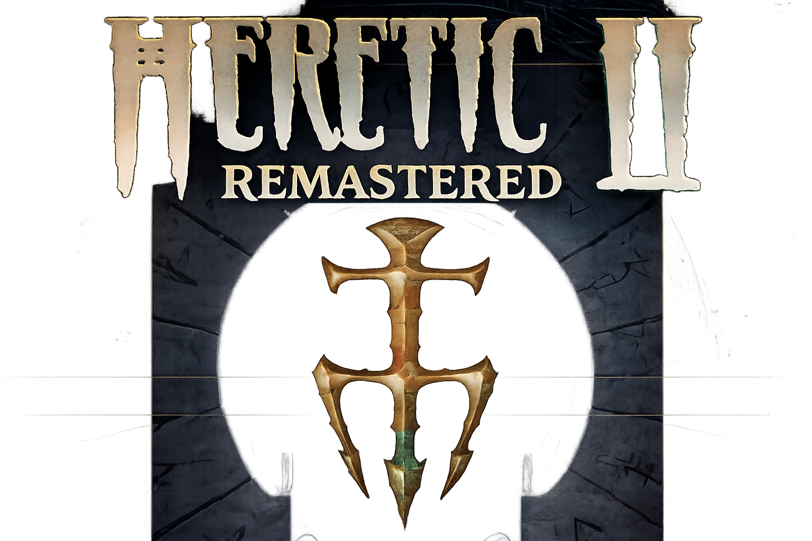

# Heretic II Apple Silicon

Native macOS Apple Silicon port and app packaging work for **Heretic II Remastered**, based on the Heretic2R source port and the Spacefarer Remastered asset/runtime direction.

This repository tracks the source, macOS compatibility work, build scripts, and project notes for the Apple Silicon version. It does **not** store the generated `.app` bundle or proprietary game-data PAK files.



## Quick start

There is no pre-built download — this repository is source only, so playing means building it yourself. It's four steps: get the original game data, get the free HD asset pack, build, then launch.

### Step 1 — Get the original Heretic II game data

You need `Htic2-0.pak` and `Htic2-1.pak` from a legally owned copy of the original 1998 Heretic II — this repository does not include or distribute them. As of this writing, Heretic II is not reliably available for purchase on Steam or GOG (check their store pages yourself, since that can change) — the original retail CD is the most consistent source. If you already own a digital or CD copy, these two files are in its install folder.

### Step 2 — Get the free Heretic II Remastered HD asset pack

Separately from the original game data, this port uses HD textures, music, and video assets from the [Heretic II Remastered](https://github.com/spacefarergames/Heretic2Remastered) project — an open, freely distributed enhancement pack (not the original commercial game data). Download the latest release directly from their [Releases page](https://github.com/spacefarergames/Heretic2Remastered/releases/latest) and extract `base.pak` (and, if included, the `HDTextures`/video folders) from it. This is a Windows-built release, but `base.pak` and the texture/video files inside it are plain data — you only need to extract them, not run the `.exe`.

### Step 3 — Build the app (see [Building](#building) below)

```sh
brew install sdl3 openal-soft
./build_macos_arm64.sh
```

### Step 4 — Add your game data and launch

Copy everything from Steps 1 and 2 into `build/base/`:

- `Htic2-0.pak`, `Htic2-1.pak` (Step 1)
- `base.pak`, and `HDTextures/`/video folders if you extracted them separately (Step 2)

Then launch:

```sh
./build/Heretic2R +set vid_ref gl3 +set vid_mode 0 +set vid_fullscreen 0
```

> [!NOTE]
> The bundled `Launch Heretic II Remastered.command` hardcodes `vid_display_index 3` (a specific external-monitor setup from development). If you have fewer than 4 displays connected, edit that file and remove `+set vid_display_index 3`, or change it to `0` for your primary display, before double-clicking it.

## Current State

Version `1.0` is a playable native arm64 build for Apple Silicon Macs.

Tested target:

- macOS on Apple Silicon
- Apple M4 GPU
- SDL3 Cocoa window/input
- SDL3/CoreAudio sound
- Native GL3 renderer on macOS OpenGL 4.1
- Self-contained `.app` packaging outside git

The current build can launch, reach the menu, enter gameplay through the OpenGL renderer, play audio, save configuration under the user's Application Support folder, and run in resizable windowed mode.

Recent verification also covers the OpenGL spell-combat path: spell cooking, spell release, hit FX, alpha particles, and profile-specific frame pacing have been tested on the repeatable `ssdocks` route. The visible square/diamond particle-card artifacts reported during charged spells have been removed from both graphics profiles.

## Highlights

- Native `arm64` executable and dynamic libraries.
- macOS/POSIX compatibility layer for the original Windows-oriented code.
- SDL3 video, input, gamepad, and CoreAudio backend integration.
- GL3 renderer running through macOS OpenGL 4.1 on Apple Silicon.
- High-refresh display support with refresh-aware frame caps.
- Two simplified graphics profiles:
  - **Full Power**: richer visuals and a fixed 120 FPS target where the Mac/display can keep up.
  - **Power Saver**: lighter effects with a fixed 60 FPS target for lower power use.
- Custom FPS cap override in the graphics options.
- Performance overlay for FPS, frame time, GPU time, CPU, memory, render stats, particles, and target health.
- Improved audio callback safety to avoid stale-buffer crackles during underruns.
- App bundle launch wrapper with bundle-local runtime paths.
- Disable macOS press-and-hold accent picker while playing.

## Repository Contents

- `src/` - engine, client, renderer, game, sound, platform, and tool source.
- `include/` - compatibility and third-party headers used by the port.
- `lib/` - small local library/import assets used by the project.
- `addons/` - add-on/map support files retained with the project.
- `build_macos_arm64.sh` - native Apple Silicon build script.
- `TECHNICAL_PORTING_NOTES.md` - deeper implementation notes and verification history.
- `Logo.png`, `CorvusNight.png`, `EnterThePalace.png`, `HereticVideoOverLay.png` - project images used by the README and documentation.

Generated directories such as `build/` and `Heretic II Remastered.app/` are ignored intentionally.

## Game Data

Heretic II requires original game data. This repository does not include proprietary retail or remastered PAK files. See [Quick start](#quick-start) above for where each file actually comes from.

Expected runtime data, placed under the app/build `base/` directory:

- `Htic2-0.pak`, `Htic2-1.pak` — from a legally owned copy of the original Heretic II (retail CD; check current Steam/GOG availability yourself).
- `base.pak`, and optionally `HDTextures/`/video folders — from the free, open [Heretic II Remastered](https://github.com/spacefarergames/Heretic2Remastered/releases/latest) asset pack. This one is not proprietary retail data, so it's freely downloadable from its own project.

## Building

Install dependencies with Homebrew:

```sh
brew install sdl3 openal-soft
```

Build the native Apple Silicon runtime:

```sh
./build_macos_arm64.sh
```

The script produces arm64 binaries under `build/`, including:

- `Heretic2R`
- `H2Common.dylib`
- `ref_gl3.dylib`
- `snd_sdl3.dylib`
- `base/Player.dylib`
- `base/Client Effects.dylib`
- `base/gamex86.dylib`

## Running Locally

After building and placing required game data in `build/base/`, run:

```sh
./build/Heretic2R +set vid_ref gl3 +set vid_mode 0 +set vid_fullscreen 0
```

The packaged app wrapper uses the same runtime and launches the GL3/OpenGL renderer by default.

## OpenGL Renderer

The active renderer is GL3 on macOS OpenGL 4.1:

- `vid_ref gl3`
- `ref_gl3.dylib`
- Runtime reports `Refresh: OpenGL 4.1`

```sh
./build/Heretic2R +set vid_ref gl3 +set vid_fullscreen 0 +set vid_mode 0 +set r_perf_overlay 1 +map ssdocks
```

macOS OpenGL is capped at OpenGL 4.1 and internally backed by Apple's compatibility layer, but this is the renderer currently used for development and play.

On Apple Silicon, the driver may print a string such as `GL_VERSION: 4.1 Metal - 90.5`. That is Apple's OpenGL compatibility implementation. It does not mean this project is currently using a native Metal renderer.

## Graphics Profiles

The video settings menu now exposes two user-facing profiles:

| Profile | Purpose | Default FPS behavior |
|---|---|---|
| Full Power | Best for plugged-in Macs and high-refresh displays. | Targets 120 FPS, clamped down if the display cannot present it. |
| Power Saver | Best for MacBooks on battery or cooler, quieter play. | Targets 60 FPS, clamped down if the display is lower. |

`Custom FPS Cap` overrides both profiles. Leaving it blank uses the selected profile's default. Entering a number caps both render and client frame rates, while still respecting the active display refresh.

## Version 1.0 Status

The `1.0` tag represents the current Apple Silicon baseline:

- Native arm64 build path is working.
- GL3/OpenGL renderer starts on Apple Silicon.
- Core gameplay loop is playable.
- SDL3 windowed mode and fullscreen switching are supported.
- Resizable window mode is supported.
- Performance overlay is available.
- Two-profile graphics model is implemented.
- Power Saver has verified 60 FPS frame pacing on the repeatable spell-combat route.
- Full Power has verified fixed-target 120 FPS testing on the same route, with remaining rare spikes documented for future OpenGL tuning.
- Spell cooking and combat FX no longer show the previous square/diamond particle-card artifacts in the verified profiles.
- Audio underrun handling has been hardened.
- The app bundle can be copied, signed, and launched locally.

Known constraints:

- Retail/remastered PAK data is not stored in git.
- The generated `.app` bundle is not stored in git.
- GL3 is limited to macOS OpenGL 4.1.
- Native Metal is not the active renderer in this baseline.
- Some original codebase warnings remain and are tracked as technical debt.

## Attribution

This project builds on the work of the Heretic2R source port and the wider Heretic II Remastered effort. Heretic II is the property of its respective rights holders. This repository is for preservation, porting, and compatibility work and does not grant rights to the original commercial game data.
