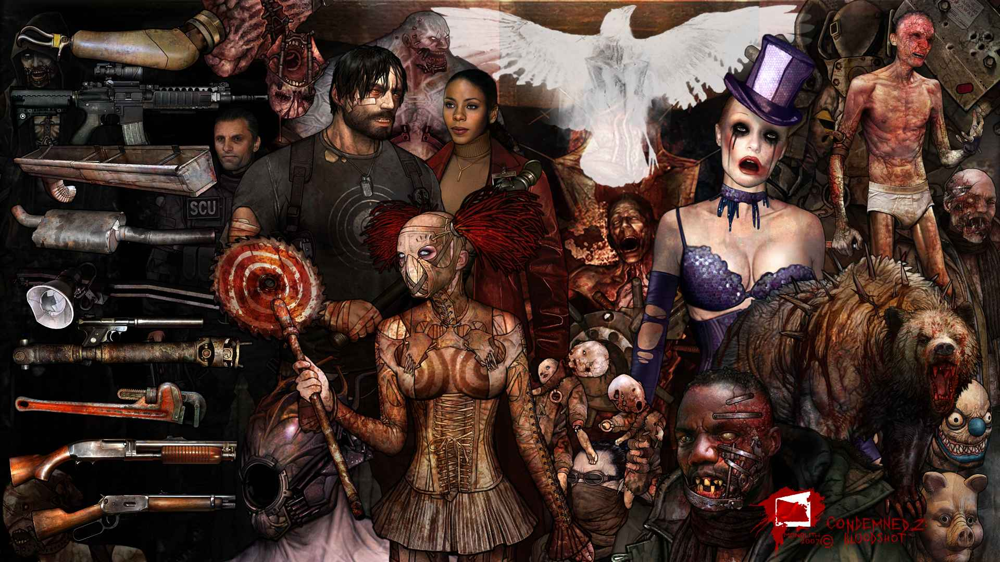
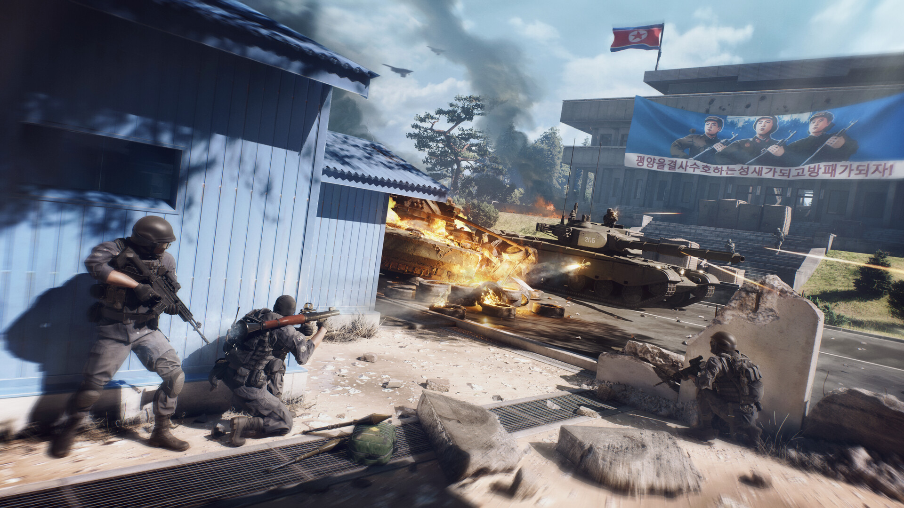
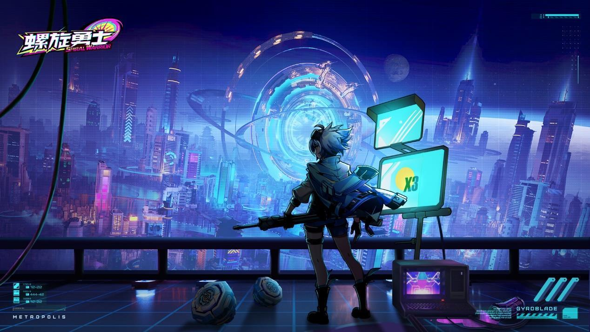
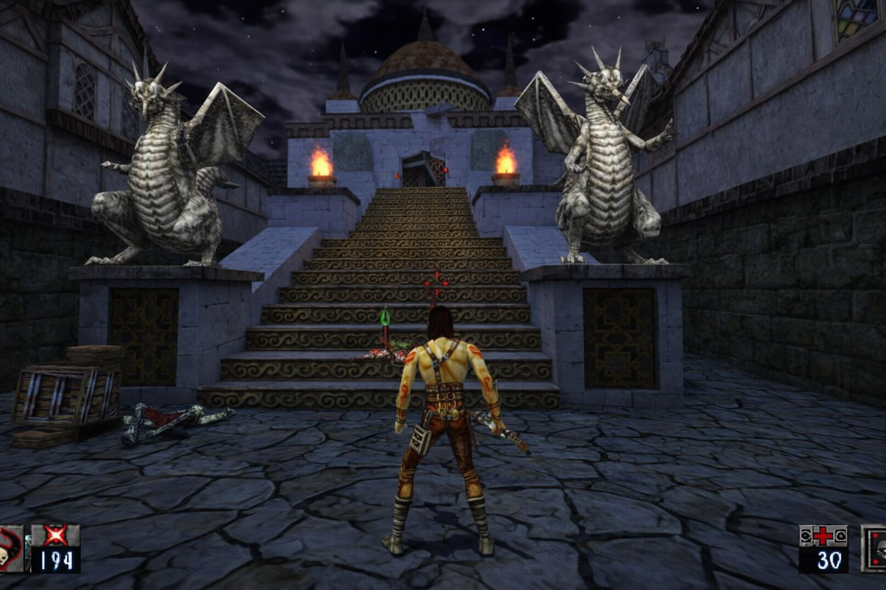
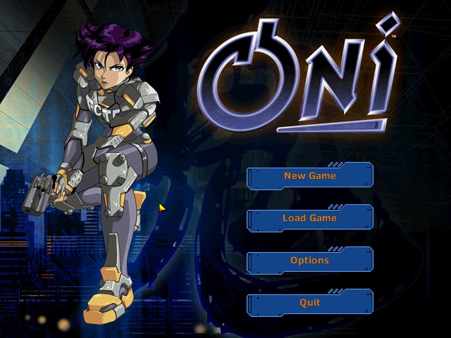

# RLabs Game Preservation Hub

RecompileLabs documents independent game preservation, recovery, and modernization work. Each project records what was investigated, what was demonstrated, and what remains uncertain.

[Projects](#different-games-shared-lessons) · [Contribute](CONTRIBUTING.md)

---

## Compatibility knowledge

The [`compatibility/`](compatibility/) directory is the shared public data layer.

- [`compatibility/schema.json`](compatibility/schema.json) defines an evidence-led JSON Schema for compatibility reports.
- [`compatibility/records/`](compatibility/records/) contains initial reports grounded in projects hosted here.

Contributed records should include the test environment and actual observations so readers can distinguish measured behavior from static clues.

## Different games. Shared lessons.

Recovery, native ports, and compatibility work. Each project adds evidence to a growing body of public knowledge.

<table>
<tr>
<td width="50%" valign="top">

<h3><a href="projects/condemned-2/">Condemned 2: Bloodshot</a></h3>

Private playable PC research build · Developer-confirmed full campaign with keyboard and mouse; no public build.

</td>
<td width="50%" valign="top">

<h3><a href="projects/world-war-3/">World War 3</a></h3>

Offline preservation · Research summary on a Windows client after its online services disappeared; the source is private.

</td>
</tr>
<tr>
<td width="50%" valign="top">

<h3><a href="projects/spiral-warrior/">Spiral Warrior</a></h3>

Service recovery · Documenting local-service preservation for a mobile game.

</td>
<td width="50%" valign="top">

<h3><a href="projects/heretic-ii-apple-silicon/">Heretic II Apple Silicon</a></h3>

Native macOS · Bringing a classic to modern Apple hardware.

</td>
</tr>
<tr>
<td width="50%" valign="top">

<h3><a href="projects/theme-hospital-apple-silicon/">Theme Hospital Apple Silicon</a></h3>

Apple Silicon &amp; Metal · Compatibility work for CorsixTH with your own game data.

</td>
<td width="50%" valign="top">

<h3><a href="projects/oni-modern/">Oni Modern</a></h3>

Windows compatibility · Launcher and configuration work for existing installations.

</td>
</tr>
<tr>
<td width="50%" valign="top">

<h3><a href="projects/openjkdf2-modern/">OpenJKDF2 Enhanced</a></h3>

Engine modernization · A modern engine path with a focus on Windows 11.

</td>
<td width="50%" valign="top"></td>
</tr>

</table>

Project documentation, requirements, and updates live inside each project folder. The older standalone repositories are archived and kept for reference: [Spiral Warrior](https://github.com/gkaragioul/spiral-warrior-offline-preservation), [Heretic II Apple Silicon](https://github.com/gkaragioul/Heretic2_Apple_Silicon), [Theme Hospital Apple Silicon](https://github.com/gkaragioul/ThemeHospital_Apple_Silicon), [Oni Modern](https://github.com/gkaragioul/OniModern) and [OpenJKDF2 Enhanced](https://github.com/gkaragioul/OpenJKDF2-Modern). The World War 3 and Condemned 2 folders are research summaries; their source is private.

## Your findings can help the next player.

You can help by testing lawfully obtained software, submitting reproducible compatibility reports, improving fixes, and documenting what you learn. Start with [`CONTRIBUTING.md`](CONTRIBUTING.md).

## Rights and safety boundary

RLabs publishes research, source code, configuration, documentation, and small credited images that identify the games discussed. The images and trademarks remain the property of their respective rights holders. This hub does not host or distribute original games, game data, proprietary clients, credentials, keys, or cracked binaries. Some projects go further than documentation, and each project's README says exactly what it contains:

- **Spiral Warrior** quotes a few short lines of the decrypted client where a patch needs them, and includes tools that decrypt and patch a copy you supply.
- **Heretic II Apple Silicon** includes maps, textures and text files from third-party fan add-ons, which belong to their authors. Their sounds, models and videos are not included.

Reports should describe observations without including private data or extracted game content.

The Condemned 2 and World War 3 pages are sanitized research summaries. Their implementation, game materials, and private RLabs evidence remain outside this public infrastructure.

Rights holders and add-on authors who believe something here should not be published can open an issue, and well-founded requests will be acted on promptly.

## License and disclaimer

The hub's own files (tools, compatibility data and documentation) are released under the [MIT License](LICENSE). Each project folder carries its own licence and notices, which cover only that project's own code and documentation, never the games, their assets or their trademarks.

Everything here is provided **as is, without warranty of any kind**. You use it at your own risk, and you are responsible for owning the games you use it with, for complying with the licences involved and with the laws where you live, and for any loss or damage that results.
