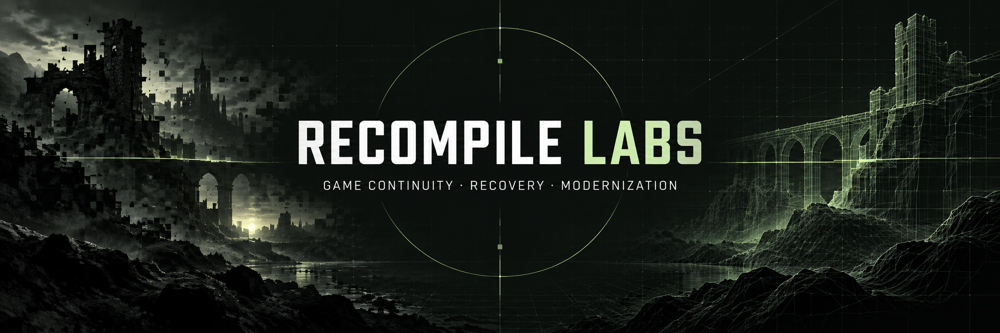
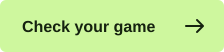

# RLabs — Compatibility, Recovery & Preservation

## Old games. New possibilities.

Games outlive the systems they were built for. We build open tools to understand what breaks—and share what it takes to keep them running.

Free to use · No account · Files stay on your device

[Website](https://recompilelabs.com/) · [Projects](#different-games-shared-lessons) · [Scanner & CLI](https://github.com/gkaragioul/rlabs-scan) · [Contribute](CONTRIBUTING.md)

---

## Compatibility knowledge

**[Check your game online with RLabs Scan](https://recompilelabs.com/#scanner)** — choose a Windows game folder; no account, Python installation, or terminal required.

The scan runs locally inside your browser. It lists the selected folder's filenames and inspects one executable, rather than uploading or reading the entire game installation. If several executables are found, you choose which one to inspect. Results can be saved or copied; nothing is submitted automatically.

Current limits: 128 MB per executable, 30,000 files per selected folder, and a 30-second scan timeout. Results describe static clues, not tested compatibility. The browser cannot determine whether a dependency is installed elsewhere in Windows.

The [`compatibility/`](compatibility/) directory is the shared public data layer.

- [`compatibility/schema.json`](compatibility/schema.json) defines an evidence-led JSON Schema for compatibility reports.
- [`compatibility/records/`](compatibility/records/) contains initial reports grounded in the projects already hosted here.
- [`RLabs Scan`](https://github.com/gkaragioul/rlabs-scan) documents the browser experience and hosts the original Python CLI for advanced use. The [`v0.1 interface specification`](docs/rlabs-scan-v0.1.md) describes the original CLI design, not the browser interface.

The hub schema is separate from scanner exports. Browser downloads use `rlabs-browser-scan` version 1 and are supporting evidence, not ready-to-merge compatibility records. Add your test environment and actual observations when contributing a record under the hub schema.

## Different games. Shared lessons.

Recovery, native ports, and compatibility work. Each project adds evidence to a growing body of public knowledge.

<table>
<tr>
<td width="50%" valign="top">

<h3><a href="projects/world-war-3/">World War 3</a></h3>

Offline preservation · Understanding a Windows client after its online services disappear.

</td>
<td width="50%" valign="top">

<h3><a href="projects/spiral-warrior/">Spiral Warrior</a></h3>

Service recovery · Documenting local-service preservation for a mobile game.

</td>
</tr>
<tr>
<td width="50%" valign="top">

<h3><a href="projects/heretic-ii-apple-silicon/">Heretic II Apple Silicon</a></h3>

Native macOS · Bringing a classic to modern Apple hardware.

</td>
<td width="50%" valign="top">

<h3><a href="projects/theme-hospital-apple-silicon/">Theme Hospital Apple Silicon</a></h3>

Apple Silicon &amp; Metal · Compatibility work for CorsixTH with your own game data.

</td>
</tr>
<tr>
<td width="50%" valign="top">

<h3><a href="projects/oni-modern/">Oni Modern</a></h3>

Windows compatibility · Launcher and configuration work for existing installations.

</td>
<td width="50%" valign="top">

<h3><a href="projects/openjkdf2-modern/">OpenJKDF2 Modern</a></h3>

Engine modernization · A modern engine path with a focus on Windows 11.

</td>
</tr>
</table>

Project documentation, requirements, and updates live inside each project folder. The previous standalone repositories remain public historical references where applicable.

## Your findings can help the next player.

You can help by testing lawfully obtained software, submitting reproducible compatibility reports, improving fixes, and documenting what you learn. Start with [`CONTRIBUTING.md`](CONTRIBUTING.md).

## Rights and safety boundary

RLabs publishes research, source code, configuration, and documentation only. It does not host or distribute original games, commercial assets, proprietary clients, decrypted source, credentials, keys, or cracked binaries. Reports should describe observations without including private data or copyrighted game content.

Condemned 2 and private RLabs research remain separate from this public infrastructure.
