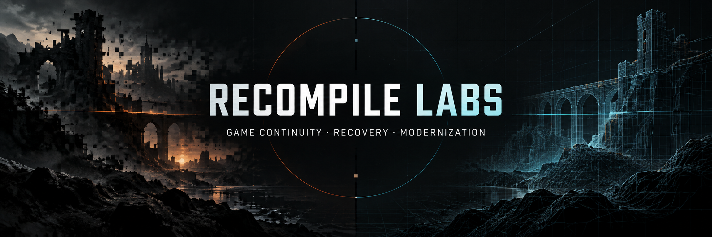

# Game Preservation Hub

> **RECOMPILE LABS** · Game continuity, recovery, and modernization.

This repository is the single GitHub home for projects that investigate, recover, and modernize game software when its original technical path no longer works.

## Projects

- [World War 3 — Offline Preservation Toolkit](projects/world-war-3/)
- [Spiral Warrior — Offline Preservation Toolkit](projects/spiral-warrior/)
- [Heretic II Apple Silicon](projects/heretic-ii-apple-silicon/)
- [Theme Hospital Apple Silicon](projects/theme-hospital-apple-silicon/)
- [Oni Modern](projects/oni-modern/)
- [OpenJKDF2 Modern](projects/openjkdf2-modern/)

Project-specific documentation, requirements, and updates are kept in each project folder. The original repositories are archived as read-only historical references.

This hub distributes no original game files, assets, clients, or proprietary content. The original standalone repositories are archived as read-only historical references.
