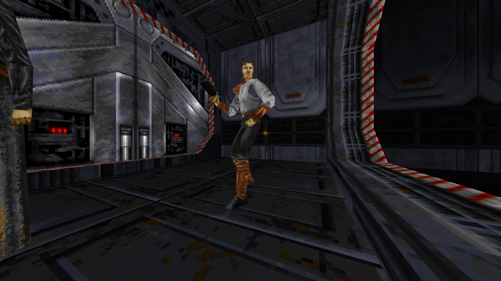

# OpenJKDF2 Modern

A Windows 11-focused modern-experience fork of OpenJKDF2 that makes *Star Wars:
Jedi Knight - Dark Forces II* comfortable on a current PC: modern FPS controls
by default, native-resolution Borderless Fullscreen, safer display switching,
improved frame pacing, and observable OpenGL 3.3 rendering.

**[Download release 1.0](https://github.com/gkaragioul/OpenJKDF2-Modern/releases/tag/1.0)** ·
**[Release notes](docs/RELEASE-1.0.md)** · **[Licensing guide](LICENSING.md)**

> [!IMPORTANT]
> This download contains the enhanced engine only. It includes **no game files**.
> You need a legally owned installation of *Jedi Knight: Dark Forces II* from
> [Steam](https://store.steampowered.com/app/32380/) or
> [GOG](https://www.gog.com/en/game/star_wars_jedi_knight_dark_forces_ii).

> [!WARNING]
> The current 1.0 community binaries are not yet code-signed. Windows 11 Smart
> App Control may therefore report **"An Application Control policy has blocked
> this file"**, even when the ZIP hash is correct. Smart App Control has no
> per-app exception: use a future release signed by a trusted certificate, or
> make an informed system-wide choice under **Windows Security > App & browser
> control > Smart App Control**. Turning it off is not required on systems where
> the package runs normally. See the [Windows troubleshooting guide](packaging/windows/TROUBLESHOOTING.md#smart-app-control-blocks-the-game).

## Screenshots

| Gameplay | Modern controls |
| --- | --- |
| [](docs/images/amd-enhanced-gameplay.png) | [](docs/images/amd-enhanced-modern-controls.png) |
| **Borderless at native resolution** | **Built-in diagnostics** |
| [](docs/images/amd-enhanced-display-options.png) | [](docs/images/amd-enhanced-diagnostics.png) |

Screenshots use a locally owned game installation for technical demonstration;
original game content is not included in this repository or its downloads.

## What this fork adds

- Modern FPS controls for new players, plus an in-game Modern/Classic switch.
- Borderless Fullscreen at the primary monitor's native resolution by default.
- Working monitor, mode, resolution, and refresh-behavior controls under Display
  Options, with confirmation and restoration safeguards.
- Standards-compliant OpenGL 3.3 fixes, shader/framebuffer diagnostics, renderer
  fallbacks, and hardware evidence from the tested Radeon RX 7900 XTX system.
- Configurable frame caps, VSync, frame-pacing telemetry, FOV, HUD scale, SSAA,
  bloom, SSAO, filtering, and optional user-owned enhancement packs.
- Read-only discovery of Steam/GOG game data, isolated per-user saves/settings,
  portable mode, crash diagnostics, and a Windows display watchdog.

AMD hardware is not required. The release is not vendor-locked: its rendering
paths use standards-based capability checks and fallbacks, so it is intended for
AMD, NVIDIA, and Intel GPUs that meet the OpenGL requirement. AMD/RDNA is the
hardware family used for the recorded test evidence; other vendors remain
unverified rather than unsupported.

## Requirements

- 64-bit Windows 11 (the supported and tested release target).
- A GPU and driver supporting an OpenGL 3.3 core profile.
- A legal Steam or GOG installation of *Jedi Knight: Dark Forces II*.
- Less than 20 MB extracted for the engine package, separate from the original
  game.

## Install in three steps

1. Download the 1.0 ZIP from the
   [1.0 release](https://github.com/gkaragioul/OpenJKDF2-Modern/releases/tag/1.0).
   Create a new writable folder for the port, then extract the **entire** ZIP
   there. Keep the package layout intact. **Do not** merge these files into the
   original Jedi Knight folder.
2. In the extracted folder, right-click `Install.ps1` and choose **Run with
   PowerShell**. If Windows blocks scripts, open PowerShell in that folder and run:

   ```powershell
   powershell.exe -NoProfile -ExecutionPolicy Bypass -File .\Install.ps1
   ```

3. Start **OpenJKDF2 Modern** from the new desktop shortcut. The launcher
   searches common Steam and GOG locations. If it cannot find the game, select
   the original installation folder containing `JK.EXE`, `Episode\JK1.GOB`,
   `Resource\Res1hi.gob`, and `Resource\Res2.gob` when prompted.

The engine reads the original installation in place; it does not copy or modify
your game files.

### First launch checklist

- New player profiles use Modern controls automatically. Imported or customized
  profiles keep their existing bindings so the port does not overwrite them.
- If looking up and down is inverted, or right-click jumps, open
  **Setup → Controls → Options → Control Style**, choose **Modern**, then
  select **Apply Control Style**. This is saved to the active player profile.

### Portable mode and uninstall

- Run the portable launcher from the extracted package to keep
  saves and settings in its local `UserData` folder.
- Run the installed `Uninstall.ps1` to remove the app and shortcut. Original game
  files and normal saves under `%LOCALAPPDATA%\OpenJKDF2 AMD Enhanced` are never
  deleted by the uninstaller.

## Modern controls

Modern is the default for new player profiles:

| Action | Default input |
| --- | --- |
| Move / look | WASD / mouse |
| Primary / secondary fire | Left mouse / right mouse |
| Jump / crouch | Space / Ctrl or C |
| Run / use | Shift / E |
| Weapons | Mouse wheel or number keys |
| Map / menu | Tab / Escape |

Switch at any time through **Setup → Controls → Options → Control Style**. Choose
**Modern** or **Classic**, then select **Apply Control Style**. The choice is
saved to the active player profile. Existing customized profiles are intentionally
preserved and may need this one-time selection after upgrading.

## Display modes

Open **Setup → Display → Display Options** to choose:

- **Borderless Fullscreen (Recommended):** the default; uses the selected
  monitor's desktop pixel count and refresh behavior without a title bar or
  taskbar.
- **Windowed:** editable width and height for desktop use.
- **Exclusive Fullscreen:** shown only when the exact desktop-state restoration
  watchdog has completed its safety preflight.

Changes require confirmation and fall back to the last known-good display state
if confirmation fails.

## Verify the download

The release includes `SHA256SUMS.txt`. From the download folder, run:

```powershell
Get-FileHash .\OpenJKDF2-AMD-Enhanced-windows-x64-1.0.zip -Algorithm SHA256
Get-Content .\SHA256SUMS.txt
```

The two SHA-256 values must match. Build provenance and a full package manifest
are also included inside the ZIP.

## Troubleshooting

- **Game not found:** run the launcher again and select the installation folder
  containing `JK.EXE`, `Episode\JK1.GOB`, `Resource\Res1hi.gob`, and
  `Resource\Res2.gob`.
- **Inverted vertical look or legacy mouse buttons:** apply the **Modern** control
  style from **Setup → Controls → Options → Control Style**. Imported or
  customized player profiles are not overwritten automatically.
- **Application Control policy blocked the game:** the 1.0 binaries are unsigned,
  and Windows 11 Smart App Control does not support a per-app exception. Verify
  the release SHA-256 first, then read the
  [Smart App Control guidance](packaging/windows/TROUBLESHOOTING.md#smart-app-control-blocks-the-game)
  before changing any system-wide security setting.
- **Display changed unexpectedly:** restart normally; the watchdog and recovery
  snapshot restore the last known-good desktop configuration.
- **Settings or saves:** normal mode uses `%LOCALAPPDATA%\OpenJKDF2 AMD Enhanced`;
  portable mode uses `UserData` beside the package.
- **Renderer problem:** open **Setup → Display → Advanced → Diagnostics**, then
  include the diagnostics files when filing an issue.

See [TROUBLESHOOTING.md](packaging/windows/TROUBLESHOOTING.md) and
[COMPATIBILITY.md](COMPATIBILITY.md) for detailed limitations and evidence.

## Build from source

Clone the exact release, including pinned submodules:

```powershell
git clone --branch 1.0 --recurse-submodules https://github.com/gkaragioul/OpenJKDF2-Modern.git
cd OpenJKDF2-Modern
powershell.exe -NoProfile -ExecutionPolicy Bypass -File scripts\build-windows.ps1 -Configuration Release -Test
```

The required Visual Studio 2022 Build Tools, CMake, Ninja, Python/cogapp setup,
and Debug build command are documented in
[docs/building-windows.md](docs/building-windows.md).

## Source, licenses, and attribution

This project is a downstream modernization fork of
[OpenJKDF2](https://github.com/shinyquagsire23/OpenJKDF2), the original project
by the OpenJKDF2 contributors. Upstream OpenJKDF2 provides the cross-platform
engine foundation; this repository adds its Windows-focused experience,
packaging, diagnostics, and verification work. The original project and George
Karagioules's modifications are distributed under the custom
permission and warranty terms in [LICENSE.md](LICENSE.md); third-party components
retain their own licenses. Read [LICENSING.md](LICENSING.md),
[THIRD-PARTY-NOTICES.md](packaging/windows/THIRD-PARTY-NOTICES.md), and the
package's `Licenses` directory before redistributing binaries.

No Lucasfilm game files or game assets—including levels, textures, models,
music, video, dialogue, scripts, or proprietary executables—are distributed.
STAR WARS, Jedi Knight, LucasArts, Lucasfilm, and related marks belong to
Lucasfilm Ltd. AMD and AMD Radeon are trademarks of Advanced Micro Devices,
Inc. This independent community fork is not affiliated with or endorsed by
Lucasfilm, Disney, AMD, Valve, GOG, or the upstream OpenJKDF2 maintainers.
