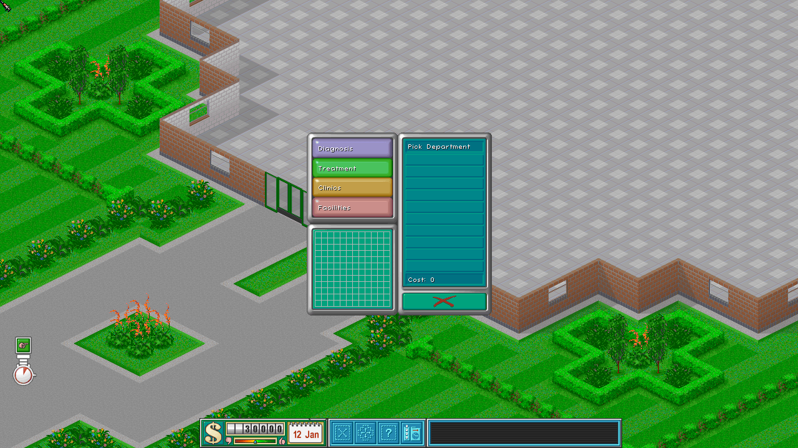

# Theme Hospital Apple Silicon

Native Apple Silicon and Metal renderer work for [CorsixTH](https://github.com/CorsixTH/CorsixTH), the open-source reimplementation of Theme Hospital.

This repository contains source code, build configuration, and compatibility work only. It does not include Theme Hospital game data, GOG installers, original assets, music, videos, manuals, or a playable commercial game bundle.



## Download this project

- **Simple download:** [Download the Theme Hospital Apple Silicon source ZIP](https://github.com/gkaragioul/game-preservation-hub/releases/download/project-downloads-v1/theme-hospital-apple-silicon.zip). This archive contains only this project.
- **Only this project:** run the commands below to download just the Theme Hospital Apple Silicon folder.

```bash
git clone --filter=blob:none --sparse https://github.com/gkaragioul/game-preservation-hub.git
cd game-preservation-hub
git sparse-checkout set projects/theme-hospital-apple-silicon
```

## Quick start

Three steps: get your own game files, build the app, then launch and point it at those files.

### Step 1 — Get your own Theme Hospital game files

You need one of the following, legally obtained — this repository does not provide any of them:

- A download from [GOG.com](https://www.gog.com/game/theme_hospital) or [EA](https://www.ea.com/games/theme/theme-hospital), or
- The original game CD.

Install it anywhere on your Mac (the default GOG/EA install location works fine — see Step 3, it's found automatically).

### Step 2 — Build the app (see [Apple Silicon Build](#apple-silicon-build) below)

Run the `brew install`, `cmake -S -B`, and `cmake --build`/`--install` commands in that section. This produces `build/apple-silicon-install/CorsixTH.app`.

### Step 3 — Launch and point it at your game files

Open `CorsixTH.app`. On first launch it automatically scans common install locations, including GOG's default folders (`GOG Galaxy/Games/Theme Hospital`, `GOG.com/Theme Hospital`, `GOG Games/Theme Hospital`) and the app's own folder. If it finds a valid copy, you're playing immediately — nothing else to do.

If it can't find one automatically, it opens a folder-browser dialog asking you to select your Theme Hospital installation folder directly. Pick the folder that contains the game's original data files and it starts.

You can change this later from in-game: **Options → Folders**, then browse to a different Theme Hospital installation.

## What Works

- Native `arm64` build using Apple Clang, CMake, Ninja, and Homebrew dependencies.
- Native Metal 2D rendering for menus and active hospital gameplay, with SDL retained as a reference path.
- Measured 60 Hz and 120 Hz-class frame pacing on the tested Apple Silicon host.
- Window resize, fullscreen recovery, input, save persistence, and Finder-style launch paths verified locally.
- Open-source application resources and runtime libraries packaged separately from user-owned game data.

The current source is a development snapshot. Public binary distribution still requires Developer ID signing, notarization, Gatekeeper verification, and a separate release audit.

## Game Data

CorsixTH requires data from a legally obtained copy of Theme Hospital. Users must provide their own game files at runtime.

No game files or protected assets are included here. Do not open an issue asking where to download them.

## Apple Silicon Build

Install the verified Homebrew dependencies:

```sh
brew install cmake ninja sdl2 sdl2_mixer lua luarocks rtmidi
```

Configure an arm64 build:

```sh
cmake -S . -B build/apple-silicon-release \
  -G Ninja \
  -DCMAKE_BUILD_TYPE=RelWithDebInfo \
  -DCMAKE_OSX_ARCHITECTURES=arm64 \
  -DCMAKE_PREFIX_PATH=/opt/homebrew \
  -DCMAKE_LIBRARY_PATH=/opt/homebrew/lib \
  -DRTMIDI_LIBRARIES=/opt/homebrew/lib/librtmidi.dylib \
  -DRTMIDI_INCLUDE_DIRS=/opt/homebrew/include \
  -DWITH_LUAROCKS=ON \
  -DCMAKE_INSTALL_PREFIX="$PWD/build/apple-silicon-install"
```

Build and install the local app bundle:

```sh
cmake --build build/apple-silicon-release --parallel
cmake --install build/apple-silicon-release
```

The installed app is created at `build/apple-silicon-install/CorsixTH.app`. See [Step 3](#step-3--launch-and-point-it-at-your-game-files) above for pointing it at your own legally obtained Theme Hospital data.

## Project Boundaries

- Source and open project resources: included.
- Generated app bundles and build outputs: excluded.
- Theme Hospital data, installers, media, and manuals: excluded.
- User configuration, saves, screenshots, and local paths: excluded.

Theme Hospital and related names and assets belong to their respective rights holders. This project is independent preservation and compatibility work and does not grant rights to the original commercial game.

## Upstream and License

This work builds on CorsixTH. See [UPSTREAM_README.md](UPSTREAM_README.md) for the upstream project documentation and attribution.

CorsixTH's primary source is MIT-licensed, with bundled components covered by their respective terms. The complete notices and third-party licenses are preserved in [LICENSE](LICENSE).
